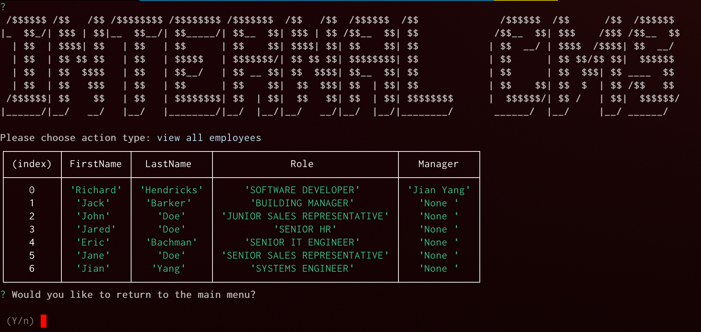

### MIT License

[](https://opensource.org/licenses/MIT)

# MySQL CMS Builder

## Description

A simple cli-based Content Management System (CMS) tool with MySQL backend. This rudimentary setup can be extended with added functionality. Follow the instructions on how to install and use it locally.

## Installation Instructions

> NOTE: Make sure you have `Node.JS ~v16.14.2` and `NPM ~8.5.0` installed. You can quickly check this by running `node -v` for Node.JS and `npm -v` for NPM in your terminal. Additionally it requires `mysql ~8.0.29`

### Install local dependencies

Once the above is confirmed, clone the repo `git clone git@github.com:rkutsel/mysql-cms-builder.git` and install the dependencies by running `npm i` in your terminal. I recommend you install them locally. A successful installation should look somewhat similar to the one bellow:

```bash
added 67 packages, and audited 68 packages in 1s

15 packages are looking for funding
  run `npm fund` for details

found 0 vulnerabilities
```

> ./db directory has schema.sql and seed.sql that are required to be imported into the database. Note that the username and password are there for demo purposes. This set up is not meant to be run in production.

### Import DB schema and seed data into MySQL

```bash
mysql -u root -p < db/schema.sql
mysql -u root -p < db/seed.sql
```

## Usage with Examples

To get your started simply run `node index` from the root directory to have a prompt ask you a serious of questions. At the end of it, it will generate an index.html file and save it in `./dist/` directory. You should be seeing a similar output as shown below:

```bash
> nodeindex
```

```
?
 /$$$$$$ /$$   /$$ /$$$$$$$$ /$$$$$$$$ /$$$$$$$  /$$   /$$  /$$$$$$  /$$              /$$$$$$  /$$      /$$  /$$$$$$
|_  $$_/| $$$ | $$|__  $$__/| $$_____/| $$__  $$| $$$ | $$ /$$__  $$| $$             /$$__  $$| $$$    /$$$ /$$__  $$
  | $$  | $$$$| $$   | $$   | $$      | $$    $$| $$$$| $$| $$    $$| $$            | $$  __/ | $$$$  /$$$$| $$  __/
  | $$  | $$ $$ $$   | $$   | $$$$$   | $$$$$$$/| $$ $$ $$| $$$$$$$$| $$            | $$      | $$ $$/$$ $$|  $$$$$$
  | $$  | $$  $$$$   | $$   | $$__/   | $$ __ $$| $$  $$$$| $$__  $$| $$            | $$      | $$  $$$| $$ ____  $$
  | $$  | $$   $$$   | $$   | $$      | $$    $$|  $$  $$$| $$  | $$| $$            | $$    $$| $$  $  | $$ /$$   $$
 /$$$$$$| $$    $$   | $$   | $$$$$$$$| $$  | $$|  $$   $$| $$  | $$| $$$$$$$$      |  $$$$$$/| $$ /   | $$|  $$$$$$/
|______/|__/   __/   |__/   |________/|__/  |__/|__/   __/|__/  |__/|________/       ______/  |__/     |__/ ______/

Please choose action type: (Use arrow keys)
❯ CANCEL
  view all departments
  view all roles
  view all employees
  add a department
  add a role
  add an employee
(Move up and down to reveal more choices)
```


